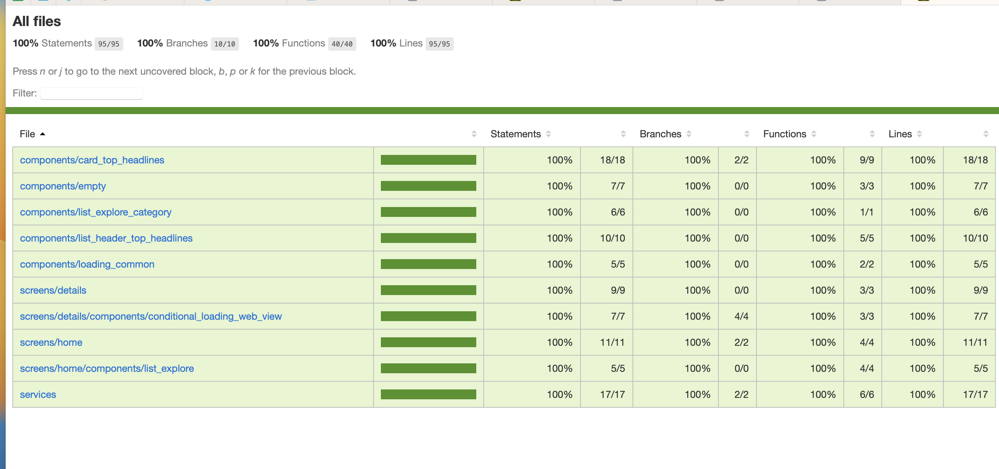

# News cool
Aplicativo de notícias, podendo selecionar as categorias ou buscar um artigo



# Feature
- Reforcei o uso de testes na aplicação, a maior dificuldade encontrada foi falta dependências
- Abaixo algumas bibliotecas que usei e dependências que auxiliaram criar testes em react native

```txt

 "@testing-library/jest-dom": "^5.17.0",
 "@testing-library/jest-native": "^5.4.2",
 "@testing-library/react-hooks": "^8.0.1",
 "@testing-library/react-native": "^12.1.2",

```


##
- Importante dos testes é garantir que o comportamento do usuário ao usar o App não haveria bugs
- Exemplo precisava testar uma função que alterava o tamanho do texto, eu não preciso usar a função real, ou seja, testar detalhes de implementação, posso usar um mock, pois essa abordagem  garanto que o comportamento esperado será alcançado


```typescript
 it('should the TextInput increase in size as you type', async () => {
    const { getByRole } = render(
      <ListHeader
        inputHeight={7}
        onContentSizeChange={(content) =>
          mockHandleHeightInput(
            content.nativeEvent.contentSize.height + 10
          )
        }
        returnPaddingIFPlataformIos={() => {
          return 3
        }}
      />
    )

    const input = getByRole('search')
    fireEvent(input, 'onContentSizeChange', mockContentSize)

    expect(mockHandleHeightInput).toHaveBeenCalledWith(40)
  })

```
## 
- Aprendi a usar novos mocks como Mockar a plataforma em uso, pois conforme se fosse IOS colocava um padding no input se fosse Android ficava zero
- No App havia possibilidade de modo ligth e dark, escolhi trabalhar com emotion para estilos, então implementei dois temas é conforme mudava o colorScheme alterava entre ligth e dark
- Criei um componente que tratava isso, coloquei no topo da hierarquia

```typescript

// theme provider
import {ThemeProvider} from '@emotion/react';
import {ReactNode, useEffect, useState} from 'react';
import {Appearance} from 'react-native';
import lightTheme from './light.theme';
import darkTheme from './dark.theme';
import {SafeAreaProvider} from 'react-native-safe-area-context';

enum TypeTheme {
  light = 'ligth',
  dark = 'dark',
}

interface IThemeProviderColorScheme {
  children: ReactNode;
}

export default function ThemeProviderColorScheme({
  children,
}: IThemeProviderColorScheme) {
  const apparence =
    Appearance.getColorScheme() === 'light' ? TypeTheme.light : TypeTheme.dark;
  const [typeTheme, setTypeTheme] = useState<TypeTheme>(apparence);

  useEffect(() => {
    Appearance.addChangeListener(listener => {
      setTypeTheme(
        listener.colorScheme === 'light' ? TypeTheme.light : TypeTheme.dark,
      );
    });
  }, []);

  return (
    <SafeAreaProvider>
      <ThemeProvider
        theme={typeTheme === TypeTheme.light ? lightTheme : darkTheme}>
        {children}
      </ThemeProvider>
    </SafeAreaProvider>
  );
}


//app tsx
import { NavigationContainer } from '@react-navigation/native'
import ThemeProviderColorScheme from '@/themes/ThemeProviderColorScheme'
import RoutesApp from '@/routes/routes.app'
import { QueryClientProvider } from '@tanstack/react-query'
import { queryClient } from '@/client/query_client'

export default function App() {
  return (
    <ThemeProviderColorScheme>
      <NavigationContainer>
        <QueryClientProvider client={queryClient}>
          <RoutesApp />
        </QueryClientProvider>
      </NavigationContainer>
    </ThemeProviderColorScheme>
  )
}


```

##
- Dicas de erros que peguei ao longo da aplicação, quando começar uma biblieoteca acusar erro de ***Jest Failure - SyntaxError: Cannot use import statement outside a module*** precisa ignorar ela no transformIgnorePatterns, coloque o nome da lib  dentro desse array
- Repara abaixo que ignorei o react-native-vector-icons e react-native-webvieww
- Para usar webView precisei mocar TurboModule
- Se react query começar acusar erro(***Jest did not exit one second after the test run completed resolve**) e recomendado zerar o cacheTime  colocar false o retry, para isso criei um mock para o client do react query
- Também comecei a pegar erro de import ***You are trying to `import` a file after the Jest environment has been torn down***, parra resolver usei o useFakeTimers()

```typescript

"transformIgnorePatterns": [   "node_modules/(?!(@react-native|react-native|react-native-vector-icons|react-native-webview)/)" ],

jest.mock(
  'react-native/Libraries/TurboModule/TurboModuleRegistry',
  () => {
    const turboModuleRegistry = jest.requireActual(
      'react-native/Libraries/TurboModule/TurboModuleRegistry'
    )
    return {
      ...turboModuleRegistry,
      getEnforcing: (name) => {
        if (name === 'RNCWebView') {
          return null
        }
        return turboModuleRegistry.getEnforcing(name)
      },
    }
  }
)
 
 //mocar plataform
 jest.mock('react-native/Libraries/Utilities/Platform', () => ({
  OS: 'android',
  select: () => null,
}))


//client mock react query

import { QueryClient } from '@tanstack/query-core'

export const mockClient = new QueryClient({
  defaultOptions: {
    queries: {
      retry: false,
      cacheTime: 0, //React Native: Jest did not exit one second after the test run completed resolve o problema
    },
  },
})


//useFakeTimers precisa estar acima do compoente no render
it('should render the flatlist with the correct data', async () => {
    const { result, waitFor } = renderHook(
      () => useTopHeadlinesServices(),
      { wrapper: wrapperClientProvider }
    )
    await waitFor(() => result.current.isSuccess)
    jest.useFakeTimers()
    const { getByTestId } = render(<HomeScreen />)
    const element = getByTestId(ConstantsUtils.testIdFlatlistNews)
    expect(element.props.data).toEqual(
      result.current.dataTopHeadlines.articles
    )
  })


```


